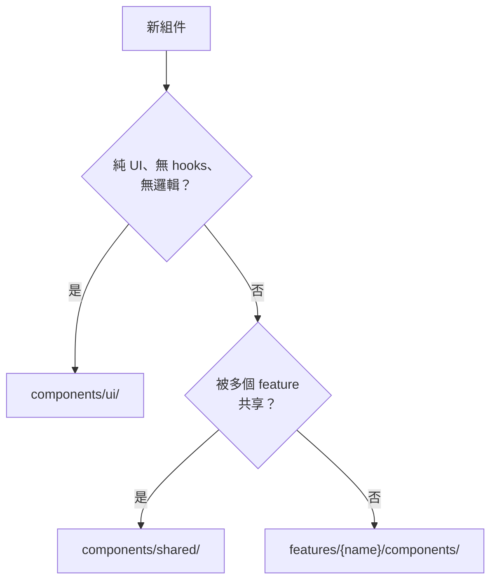

# Architecture Guide

本專案的架構設計、組件開發指南與 Context 組織方式。

## Project Structure

本專案採用 **Feature-First + Category Grouping** 的組織方式：

```
src/
├── components/                  # 共享組件
│   ├── ui/                      # 純 UI 組件庫（展示組件）
│   │   ├── Button/
│   │   │   ├── Button.tsx
│   │   │   ├── Button.test.tsx
│   │   │   └── index.ts
│   │   ├── LightBox/
│   │   │   ├── LightBox.tsx
│   │   │   ├── LightBox.test.tsx
│   │   │   ├── LightBox.types.ts
│   │   │   └── index.ts
│   │   ├── Modal/
│   │   ├── Card/
│   │   └── index.ts             # Barrel export
│   │
│   ├── shared/                  # 容器組件（有邏輯、有 hooks）
│   │   ├── ThemeToggle/
│   │   │   ├── ThemeToggle.tsx
│   │   │   ├── ThemeToggle.test.tsx
│   │   │   └── index.ts
│   │   ├── DayNightVisuals/
│   │   │   ├── DayNightVisuals.tsx
│   │   │   ├── DayNightVisuals.test.tsx
│   │   │   └── index.ts
│   │   ├── Header/
│   │   └── index.ts             # Barrel export
│   │
│   └── index.ts                 # 頂層 Barrel export (可選)
│
├── context/                     # React Context + Providers
│   ├── theme/
│   │   ├── ThemeContext.ts
│   │   ├── ThemeProvider.tsx
│   │   ├── useTheme.ts
│   │   ├── theme.types.ts
│   │   └── index.ts
│   │
│   ├── auth/                    # (可選)
│   │   ├── AuthContext.ts
│   │   ├── AuthProvider.tsx
│   │   ├── useAuth.ts
│   │   ├── auth.types.ts
│   │   └── index.ts
│   │
│   └── index.ts                 # Barrel export
│
├── features/                    # 業務特性模組
│   ├── portfolio/
│   │   ├── components/
│   │   │   ├── ProjectCard/
│   │   │   │   ├── ProjectCard.tsx
│   │   │   │   └── index.ts
│   │   │   └── index.ts
│   │   ├── hooks/
│   │   │   ├── useProjects.ts
│   │   │   └── index.ts
│   │   ├── types.ts
│   │   └── index.ts
│   │
│   ├── skills/
│   │   ├── components/
│   │   ├── hooks/
│   │   ├── types.ts
│   │   └── index.ts
│   │
│   └── [otherFeatures]/
│
├── hooks/                       # 全局 custom hooks
│   ├── useTheme.ts
│   ├── useLocalStorage.ts
│   └── index.ts
│
├── util/                        # 工具庫
│   ├── common.ts
│   ├── safe.ts                  # 強健錯誤處理工具
│   └── index.ts
│
├── types/                       # 全局類型定義
│   ├── common.ts
│   ├── api.ts
│   └── index.ts
│
├── services/                    # API 服務
│   ├── apiService.ts
│   └── index.ts
│
├── styles/                      # 全局樣式
│   ├── globals.css
│   └── variables.css
│
├── app/                         # App Router (Next.js)
│   ├── layout.tsx
│   ├── page.tsx
│   └── (routes)/
│
└── App.tsx
```

### 目錄說明

| 目錄 | 用途 | 命名規範 | 特點 |
|------|------|---------|------|
| `features/` | 業務特性模組 | `camelCase` | 可獨立工作的功能塊 |
| `components/ui/` | 純 UI 組件庫 | `PascalCase` | 無 hooks、無邏輯、props 驅動 |
| `components/shared/` | 容器組件 | `PascalCase` | 有 hooks、有邏輯、跨 feature 共享 |
| `context/` | React Context | `camelCase` (文件夾) | Context + Provider + Hook 分離 |
| `hooks/` | 全局 custom hooks | `camelCase` | 可復用的邏輯 |
| `util/` | 工具函數 | `camelCase` | 幫助函數、常量 |
| `types/` | 全局類型定義 | `camelCase` | 通用和 API 相關類型 |
| `services/` | API 調用服務 | `camelCase` | 數據服務層 |

### 組件位置決策指南

當創建新組件時，使用以下決策流程來判斷正確的目錄位置：



#### 快速決策問題

| # | 問題 | 是 → 位置 | 否 → 下一步 |
|---|------|----------|-------------|
| 1 | 組件完全由 props 驅動，無任何 hooks？ | `components/ui/` | 問題 2 |
| 2 | 組件被 2+ 個 features 使用？ | `components/shared/` | 問題 3 |
| 3 | 組件僅屬於特定業務功能？ | `features/{name}/components/` | 重新評估 |

#### 具體範例

```typescript
// ✅ ui/ - 純展示組件
// Button, Card, Modal, Input, LightBox
// 特點：無 useContext、useQuery 等 hooks

// ✅ shared/ - 容器組件，跨 feature 共享
// ThemeToggle (uses useTheme), Header (uses useTranslations)
// 特點：有 hooks，多處使用

// ✅ features/ - 業務特定組件
// features/portfolio/components/ProjectCard
// features/skills/components/SkillBadge
// 特點：僅在該 feature 內使用
```

---

## Component Development Guide

### 關鍵概念：Presentational vs Container Components

本項目採用 **展示組件（Presentational）vs 容器組件（Container）** 模式：

#### ✅ **展示組件** (`components/ui/`)

**特徵：**
- 無任何 custom hooks 依賴
- 無業務邏輯
- 完全由 props 驅動
- 易於測試和復用

**例子：**
```typescript
// components/ui/Button/Button.tsx
export interface ButtonProps {
  children: ReactNode;
  variant?: 'primary' | 'secondary';
  onClick?: () => void;
}

export const Button = ({ children, variant, onClick }: ButtonProps) => (
  <button className={`btn btn--${variant}`} onClick={onClick}>
    {children}
  </button>
);
```

#### ✅ **容器組件** (`components/shared/`)

**特徵：**
- 使用 custom hooks（如 `useTheme`）
- 包含業務邏輯
- 跨多個 features 共享

**例子：**
```typescript
// components/shared/ThemeToggle/ThemeToggle.tsx
import { useTheme } from '@context/theme';

export const ThemeToggle = () => {
  const { theme, toggleTheme } = useTheme();
  
  return (
    <button onClick={toggleTheme}>
      {theme === 'light' ? '🌙 Dark' : '☀️ Light'}
    </button>
  );
};
```

---

### 主題切換實作參考：Tailwind @custom-variant

本專案透過 Tailwind CSS 的自定義變體來實現更精確的主題樣式控制。

#### 1. CSS 定義 (`globals.css`)
我們定義了 `dark` 變體，使其能應用於 `.dark` 類元素及其所有子元素：
```css
/* 符合 .dark 及其下所有元素 */
@custom-variant dark (&:where(.dark, .dark *));
```

#### 2. 結構應用 (`layout.tsx`)
當 `ThemeProvider` 將 `.dark` 類應用於 `<html>` 時，內部的 `dark:` 前綴樣式會自動啟動：
```tsx
// 符合 .dark 條件時
<html className="dark">
  {/* body 及其子元素會採用 dark: 前綴的樣式 */}
  <body className="bg-white dark:bg-black">
    {/* ... */}
  </body>
</html>
```

---

### Creating Components

### 創建新的 UI 組件

#### 1. 創建目錄和文件
```bash
mkdir -p src/components/ui/ComponentName
touch src/components/ui/ComponentName/{ComponentName.tsx,index.ts,ComponentName.test.tsx}
```

#### 2. 實現組件
```typescript
// ComponentName.tsx
export interface ComponentNameProps {
  // Props 定義
}

export const ComponentName = (props: ComponentNameProps) => {
  // 實現
};

// index.ts
export { ComponentName, type ComponentNameProps } from './ComponentName';
```

#### 3. 編寫測試
```typescript
// ComponentName.test.tsx
import { render, screen } from '@testing-library/react';
import { ComponentName } from './ComponentName';

describe('ComponentName', () => {
  it('renders correctly', () => {
    render(<ComponentName />);
    expect(screen.getByRole('button')).toBeInTheDocument();
  });
});
```

### 創建新的 Feature

#### 1. 目錄結構
```
features/featureName/
├── components/
│   ├── ComponentName/
│   │   ├── ComponentName.tsx
│   │   └── index.ts
│   └── index.ts
├── hooks/
│   ├── useCustomHook.ts
│   └── index.ts
├── types.ts
└── index.ts
```

#### 2. 特性導出
```typescript
// features/featureName/index.ts
export { ComponentName } from './components/ComponentName';
export type { FeatureType } from './types';
export { useCustomHook } from './hooks/useCustomHook';
```

---

## Context Organization

### 目錄結構

React Context 應按以下方式組織，**分離職責**：

```
src/context/
├── theme/
│   ├── ThemeContext.ts          # Context 定義
│   ├── ThemeProvider.tsx        # Provider 組件
│   ├── useTheme.ts              # Custom hook
│   ├── theme.types.ts           # 類型定義
│   └── index.ts                 # Barrel export
│
├── auth/                        # (可選) 認證
│   ├── AuthContext.ts
│   ├── AuthProvider.tsx
│   ├── useAuth.ts
│   ├── auth.types.ts
│   └── index.ts
│
└── index.ts                     # 頂層 barrel export
```

### 為什麼分離 Context、Hook 和 Provider？

| 優勢 | 說明 |
|------|------|
| **職責單一** | 每個文件做一件事 |
| **易於測試** | 可以單獨測試各個部分 |
| **復用性高** | Hook 可以獨立導入使用 |
| **代碼清晰** | 結構明確易於維護 |
| **便於調試** | DevTools 可正確顯示 Context 名稱 |

### 完整實現

#### 1. 定義類型

```typescript
// src/context/theme/theme.types.ts
export type Theme = 'light' | 'dark';

export interface ThemeContextValue {
  theme: Theme;
  isDark: boolean;
  toggleTheme: () => void;
  setTheme: (theme: Theme) => void;
  hasFirstToggle: boolean;
}
```

#### 2. 創建 Context

```typescript
// src/context/theme/ThemeContext.ts
import React from 'react';
import type { ThemeContextValue } from './theme.types';

const defaultValue: ThemeContextValue = {
  theme: 'light',
  isDark: false,
  toggleTheme: () => {},
  setTheme: () => {},
  hasFirstToggle: false,
};

export const ThemeContext = React.createContext<ThemeContextValue>(defaultValue);
ThemeContext.displayName = 'ThemeContext';  // ✅ 幫助 DevTools 調試
```

#### 3. 創建自定義 Hook

```typescript
// src/context/theme/useTheme.ts
import { useContext } from 'react';
import { ThemeContext } from './ThemeContext';
import type { ThemeContextValue } from './theme.types';

/**
 * Hook to use Theme context
 * @throws Error if used outside ThemeProvider
 */
export const useTheme = (): ThemeContextValue => {
  const context = useContext(ThemeContext);
  
  // ✅ 檢查是否在 Provider 內使用
  if (!context) {
    throw new Error(
      'useTheme must be used within a ThemeProvider. ' +
      'Make sure your component is wrapped with <ThemeProvider>'
    );
  }
  
  return context;
};
```

#### 4. 創建 Provider 組件

```typescript
// src/context/theme/ThemeProvider.tsx
'use client';

import React, { useEffect, useState, ReactNode } from 'react';
import { ThemeContext } from './ThemeContext';
import type { Theme, ThemeContextValue } from './theme.types';

export interface ThemeProviderProps {
  children: ReactNode;
  initialTheme?: Theme;
  storageKey?: string;
}

export const ThemeProvider = ({
  children,
  initialTheme = 'light',
  storageKey = 'theme',
}: ThemeProviderProps) => {
  const [theme, setThemeState] = useState<Theme>(initialTheme);
  const [mounted, setMounted] = useState(false);

  // ✅ 初始化主題（從 localStorage 或系統偏好）
  useEffect(() => {
    const storedTheme = localStorage.getItem(storageKey) as Theme | null;
    const systemPrefersDark = window.matchMedia('(prefers-color-scheme: dark)').matches;
    const resolvedTheme: Theme = storedTheme || (systemPrefersDark ? 'dark' : 'light');
    
    setThemeState(resolvedTheme);
    applyTheme(resolvedTheme);
    setMounted(true);
  }, [storageKey]);

  // ✅ 應用主題到 DOM
  const applyTheme = (newTheme: Theme) => {
    const root = document.documentElement;
    if (newTheme === 'dark') {
      root.classList.add('dark');
      root.style.colorScheme = 'dark';
    } else {
      root.classList.remove('dark');
      root.style.colorScheme = 'light';
    }
  };

  const setTheme = (newTheme: Theme) => {
    setThemeState(newTheme);
    applyTheme(newTheme);
    localStorage.setItem(storageKey, newTheme);
  };

  const toggleTheme = () => {
    setTheme(theme === 'light' ? 'dark' : 'light');
  };

  // ✅ 防止 hydration 失配（Next.js SSR 環境）
  if (!mounted) {
    return <>{children}</>;
  }

  const value: ThemeContextValue = {
    theme,
    isDark: theme === 'dark',
    toggleTheme,
    setTheme,
    hasFirstToggle: true,
  };

  return (
    <ThemeContext.Provider value={value}>
      {children}
    </ThemeContext.Provider>
  );
};
```

#### 5. 設置 Barrel Export

```typescript
// src/context/theme/index.ts
export { ThemeProvider, type ThemeProviderProps } from './ThemeProvider';
export { useTheme } from './useTheme';
export { ThemeContext } from './ThemeContext';
export type { Theme, ThemeContextValue } from './theme.types';

// src/context/index.ts
export { ThemeProvider, useTheme } from './theme';
export { AuthProvider, useAuth } from './auth';  // 後續添加
```

### 使用 Context

#### 在根部應用 Provider

```typescript
// src/app/layout.tsx (Next.js App Router)
import { ThemeProvider } from '@context/theme';

export default function RootLayout({ children }: { children: React.ReactNode }) {
  return (
    <html>
      <body>
        <ThemeProvider initialTheme="light">
          {children}
        </ThemeProvider>
      </body>
    </html>
  );
}
```

#### 在組件中使用 Hook

```typescript
// src/components/shared/ThemeToggle/ThemeToggle.tsx
import { useTheme } from '@context/theme';

export const ThemeToggle = () => {
  const { theme, isDark, toggleTheme } = useTheme();

  return (
    <button onClick={toggleTheme} aria-label={`Switch to ${isDark ? 'light' : 'dark'} mode`}>
      {isDark ? '☀️ Light' : '🌙 Dark'}
    </button>
  );
};
```

### Context 最佳實踐

✅ **分離職責** - Context、Hook、Provider 各自獨立  
✅ **類型安全** - 有專門的 `.types.ts` 文件  
✅ **錯誤檢查** - Hook 內檢查 Context 是否存在  
✅ **displayName** - 幫助 DevTools 識別  
✅ **Hydration 安全** - 處理 SSR/hydration 環境  
✅ **文檔註釋** - JSDoc 說明關鍵函數  

### ❌ 常見錯誤

```typescript
// ❌ 不要：在 Provider 內使用自己的 Context
export const ThemeProvider = () => {
  const context = useContext(ThemeContext); // 會出錯
};

// ❌ 不要：Hook 內沒有檢查 Context
export const useTheme = () => useContext(ThemeContext); // 隱藏 bug

// ❌ 不要：Context 儲存過多不相關的數據
const context = { theme, user, notifications, ... }; // 職責混亂

// ❌ 不要：忽略 hydration 失配問題
// (在 SSR 環境中會導致警告)
```

---

## Export & Import Patterns

### 推薦：Named Export + Barrel Pattern

一律使用 **具名導出 (Named Export)**，並透過 **Barrel Pattern (index.ts)** 導出。這有利於 IDE 支持與 Tree Shaking。

#### 1. UI 組件結構
```typescript
// components/ui/Button/Button.tsx
export interface ButtonProps {
  children: ReactNode;
  variant?: 'primary' | 'secondary' | 'outline';
  size?: 'sm' | 'md' | 'lg';
  disabled?: boolean;
  onClick?: () => void;
}

export const Button = ({
  children,
  variant = 'primary',
  size = 'md',
  disabled = false,
  onClick,
}: ButtonProps) => {
  // 實現
};

// components/ui/Button/index.ts
export { Button, type ButtonProps } from './Button';
```

#### 2. 容器組件結構
```typescript
// components/shared/ThemeToggle/ThemeToggle.tsx
import { useTheme } from '@context/theme';

export const ThemeToggle = () => {
  const { theme, toggleTheme } = useTheme();
  // 實現
};

// components/shared/ThemeToggle/index.ts
export { ThemeToggle } from './ThemeToggle';
```

#### 3. 頂層 Barrel Export（可選但推薦）
```typescript
// components/ui/index.ts
export { Button, type ButtonProps } from './Button';
export { Modal, type ModalProps } from './Modal';
export { Card, type CardProps } from './Card';
export { LightBox, type LightBoxProps } from './LightBox';
export { Input, type InputProps } from './Input';

// components/shared/index.ts
export { ThemeToggle } from './ThemeToggle';
export { DayNightVisuals } from './DayNightVisuals';
export { Header } from './Header';

// components/index.ts (可選)
export * from './ui';
export * from './shared';
```

#### 4. 使用導入
```typescript
// ✅ 最推薦：從頂層導入
import { Button, Modal, Card } from '@components/ui';
import { ThemeToggle, DayNightVisuals } from '@components/shared';

// ✅ 也可以：從子文件夾導入
import { Button } from '@components/ui/Button';
import { ThemeToggle } from '@components/shared/ThemeToggle';

// ❌ 避免：直接導入文件
import { Button } from '@components/ui/Button/Button';

// ❌ 避免：混合默認和命名導出
import Button from '@components/ui/Button';  // 不一致
import { Modal } from '@components/ui/Modal';
```

### 為什麼選擇命名導出？

| 優勢 | 說明 |
|------|------|
| **Tree Shaking** | ✅ 支持死碼消除，減小打包體積 |
| **IDE 支持** | ✅ 重構、自動補全更強大 |
| **顯式性** | ✅ 清楚看到導入的是什麼 |
| **一致性** | ✅ 所有導入都用相同的 `{}` 語法 |

### 類型定義位置

#### 全局通用類型 → `types/`
```typescript
// types/common.ts
export interface MediaItem {
  src: string;
  alt: string;
  caption?: string;
}

export interface User {
  id: string;
  name: string;
  email: string;
}
```

#### 組件特定類型 → 組件內
```typescript
// components/ui/LightBox/LightBox.types.ts
import type { MediaItem } from '@types/common';

export interface LightBoxProps {
  items: MediaItem[];
  currentIndex: number;
  onNext: () => void;
  onPrev: () => void;
  onClose: () => void;
}

// components/ui/LightBox/LightBox.tsx
import type { LightBoxProps } from './LightBox.types';

export const LightBox = (props: LightBoxProps) => {
  // 實現
};

// components/ui/LightBox/index.ts
export { LightBox, type LightBoxProps } from './LightBox';
```
